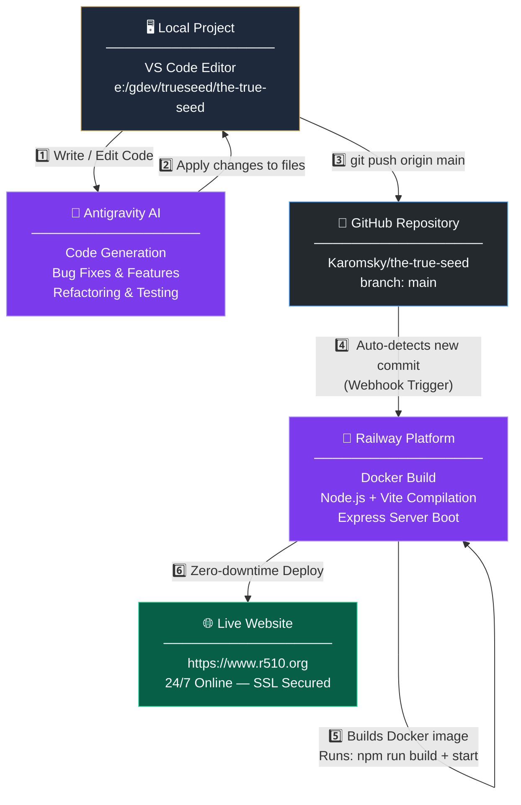

<div align="center">
  
  <h1 align="center">The True Seed</h1>
  <p align="center">A Progressive Web App (PWA) exploring the theological timeline and biblical harmony of the Iglesia Ni Cristo.</p>
</div>

---

## 📖 Overview

**The True Seed** is a full-stack web application designed to present profound biblical studies, historical prophecies, and interactive modules. Built with a heavy emphasis on dynamic UI interactions, the app provides a highly responsive, mobile-first approach to engaging with deeply rooted theological concepts.

### ✨ Key Features
* **Trilingual Support:** Complete UI and lesson content translation for English, Tagalog, and Spanish audiences.
* **Offline First (PWA):** Installs natively on Android, iOS, and desktop. Leverages Vite PWA plugins and service workers to aggressively cache content and assets for offline study.
* **Full-Stack Admin & SQLite Backend:** Includes an Express.js backend API and `better-sqlite3` database for tracking and inquiries.
* **Cloud Progress Sync:** Users can synchronize their reading progress and quiz modules between devices securely.
* **Interactive Quizzes:** End-of-lesson assessment checks utilizing dynamic Zustand application state tracking, fully localized for all three languages.
* **Fully Audited & Tested:** Extensive Playwright E2E browser simulation alongside W3C ARIA Accessible UI development.

---

## 📚 Documentation

For detailed technical information, refer to the following guides:

* **[Architecture & Tech Stack](docs/ARCHITECTURE.md)** — Core design principles and technology choices.
* **[Multi-Language System](docs/LOCALIZATION.md)** — How the `lz` localization pattern and trilingual engine work.
* **[Changelog](CHANGELOG.md)** — Track all recent features, bug fixes, and version history.

---

## 🚀 Technology Stack
* **Frontend:** React 18, Vite, Tailwind CSS styles, Framer Motion animations, Lucide React icons.
* **State Management:** Zustand with Session/Local Storage persistence.
* **Backend:** Express.js + Node.js
* **Database:** `better-sqlite3` (SQLite3)
* **Security & Auth:** `bcryptjs` and `jsonwebtoken` (JWT).
* **Testing:** Playwright for E2E testing, Vitest for unit testing.

---

## 🏗️ Folder Structure

```text
the-true-seed/
├── docs/             # Technical documentation and guides
├── src/
│   ├── components/       # Reusable UI components (AuthModal, Quizzes, UI buttons)
│   ├── content/          # Markdown and localized text content for lesson modules
│   ├── data/             # Lesson structural definitions and data exports
│   ├── store/            # Zustand global state management (useAppStore.ts)
│   ├── types/            # TypeScript interfaces
│   ├── AdminDashboard.tsx# The authenticated portal to view db inquiries
│   ├── App.tsx           # React Application Router and root layout
│   ├── BaptismPage.tsx   # Informational secondary page
│   ├── StudyPage.tsx     # The primary Study Center listing all modules
│   └── main.tsx          # Initial entry point
├── server.ts             # Express REST API, SQLite driver, and Auth Middleware
├── vite.config.ts        # Vite build configurations and PWA manifest setups
├── inquiries.db          # Auto-generated SQLite local database
├── package.json          # Node scripts and dependencies
└── playwright.config.ts  # End-to-End testing configuration
```

---

## 💻 Getting Started

### Prerequisites
* **Node.js** (v18.0.0 or higher recommended)

### Installation
1. Clone the repository and navigate inside the folder.
2. Install the application dependencies:
   ```bash
   npm install
   ```

### Running Locally (Development Mode)
To spin up both the Express Backend and the proxy Vite React frontend concurrently:
```bash
npm run start
```
The application will launch on `http://localhost:3000`.

### Production Build
When you are ready to prepare for deployment or run the compiled output:
1. Build the frontend architecture and PWA service workers:
   ```bash
   npm run build
   ```
2. Once the `dist/` directory generates successfully, boot the Express backend which seamlessly serves the compiled static payload:
   ```bash
   npm run start
   ```

---

## 🧪 Testing
The True Seed utilizes robust testing measures to ensure the integrity of the application.

* **Playwright End-to-End Tests**: Simulates a real user browser to click through navigation, submit inquiries, and validate contact forms.
  ```bash
  npx playwright test
  ```
  *To view the final HTML report, run `npx playwright show-report`*

* **Vitest Unit Testing**: Validates individual React components and logic scripts.
  ```bash
  npm run test
  ```

---

## 🚀 CI/CD Deployment Flow

This project uses a **fully automated Continuous Deployment pipeline**. Every code change flows from your local machine to the live production website automatically — no manual server work needed.



### How it works step-by-step:

| Step | Actor | Action |
|------|-------|--------|
| **1** | Developer | Opens VS Code locally at `e:/gdev/trueseed/the-true-seed` |
| **2** | **Antigravity AI** | Writes, edits, and tests code changes directly in the project files |
| **3** | Developer + AI | Runs `git add . && git commit && git push origin main` |
| **4** | GitHub | Detects the new commit on `main` and notifies Railway via a webhook |
| **5** | Railway | Pulls the latest code, builds the Docker image, compiles the React frontend (`npm run build`), and boots the Express server |
| **6** | Railway | Performs a zero-downtime swap — your visitors never see a loading screen |
| **✅** | Everyone | `https://www.r510.org` is now live with the new features! |

> 💡 **You never need to touch the Railway dashboard again for deployments.** Just run `git push` and Railway handles all of the rest automatically.

---

## 🛡️ License
Proprietary layout. Content belongs exclusively to the Iglesia Ni Cristo repository of doctrines. All Rights Reserved.
