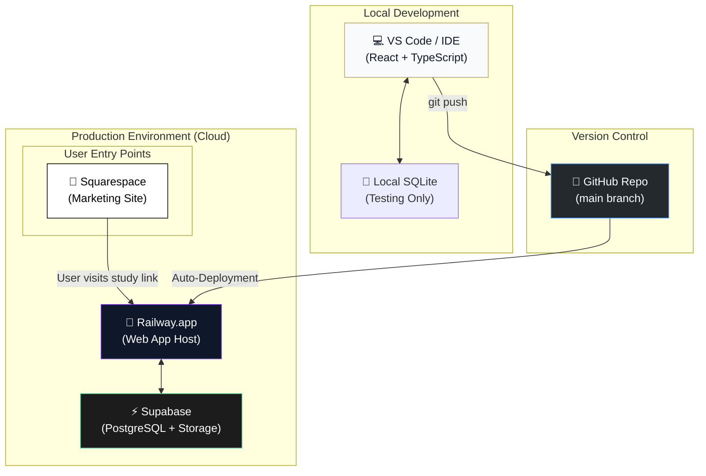

# The True Seed — Architecture & Tech Stack

This document outlines the technical design of *The True Seed* platform and the reasoning behind each architectural choice.

## 1. Project Philosophy
- **Lightweight & High-Performance**: Designed for low-bandwidth environments, prioritizing static-site generation (SSG) or fast SPA hydration.
- **Dynamic Localization**: Built from the ground up to support three primary languages (English, Tagalog, Spanish) across all interactive modules.
- **Biblical Integrity**: High-precision scripture rendering with immediate hover-access to the biblical text.

## 2. Core Tech Stack
- **Frontend Framework**: [React](https://reactjs.org/) (via [Vite](https://vitejs.dev/))
- **Hosting & CI/CD**: [Railway](https://railway.app/) for automated containerized deployment.
- **Backend & Database**: [Supabase](https://supabase.com/) (PostgreSQL) for secure, scalable cloud storage.
- **Styling**: Vanilla CSS with modern HSL variables for a premium, custom design system.
- **Content Management**: [MDX](https://mdxjs.com/) — Allows writing interactive React components directly inside markdown lesson files.
- **Iconography**: [Lucide React](https://lucide.dev/) for consistent, lightweight vector icons.
- **Animations**: [Motion for React](https://motion.dev/) for premium, fluid UI transitions.

## 3. Data Architecture

### The Lesson Registry (`src/data/lessons.tsx`)
A centralized JavaScript registry that imports frontmatter and content from 45+ MDX files. This serves as the "source of truth" for the Study Center's navigation and search indexing.

### Interactive Components
- **StudyPage.tsx**: The primary layout engine for rendering MDX lesson content and managing user progression.
- **Quiz System**: A dynamic calculation engine that uses localized JSON objects to evaluate user understanding and award mastery badges.
- **Reality Check**: A bridge component connecting the digital study to physical congregation visits, using Supabase Storage for photo verification.

## 4. Key Systems

### The Localization Pattern (`lz`)
To avoid large JSON bloating, we use a functional localization pattern (`lz`) that enables English, Tagalog, and Spanish to live in parallel without a complex i18n framework.

### The Scripture Engine (`src/scriptureData.tsx`)
A custom hook that intercepts hover events on scripture links, fetches the corresponding localized verse from the data store, and renders it in a floating modal.

## 5. System Architecture & Deployment

The following diagram represents the end-to-end flow from local development to the live production environment.

### Flow Explained:
1.  **Development**: Code is written and tested locally.
2.  **Deployment**: On `git push`, GitHub notifies Railway. Railway builds the Docker container and deploys the new version with zero downtime.
3.  **Data Persistence**: The app connects to Supabase for all user data (Inquiries, Reality Check Photos, and User Progress).
4.  **Marketing Integration**: A main Squarespace site acts as the public landing page, directing serious seekers to the Railway-hosted Study Center for deep interactive learning.

---

*Last Updated: April 3, 2026*
